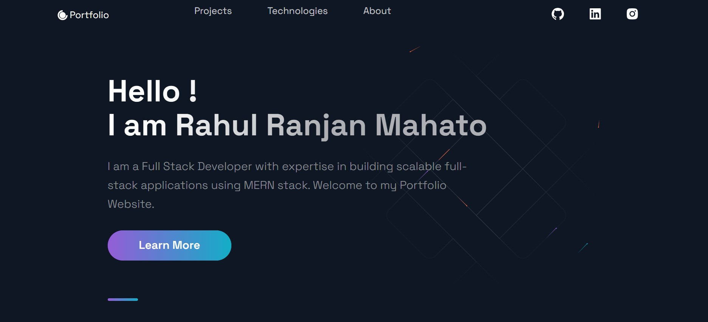

# Rahul | Personal Portfolio 🚀

This is my personal portfolio website built using **React.js** and **Next.js**.  
It showcases my skills, projects, experience, and contact information in a modern and responsive design.

---

## 📸 Portfolio Preview

  

---

## 🛠️ Built With

- **React.js**
- **Next.js**
- **JavaScript (ES6+)**
- **HTML5**
- **CSS3**
- **Responsive Design**

---

## ✨ Features

- Modern and clean UI
- Fully responsive design
- Projects showcase
- Skills & experience section
- Contact section
- Fast performance with Next.js

---

## 📂 Project Structure

Rahul-Portfolio/
├── public/image
│└── O.jpg
├── components/
├── pages/
├── styles/
├── package.json
└── README.md

---

## ⚙️ Installation & Setup

1. Clone the repository

git clone https://github.com/Rahul240620/Rahul-Portfolio.git

## 2. Navigate to the project folder

cd Rahul-Portfolio

## 3. Install dependencies

npm install

## 4. Run the development server

npm run dev

## 5. Open your browser and visit

http://localhost:3000

---

👤 Author

Rahul
GitHub: Rahul240620
